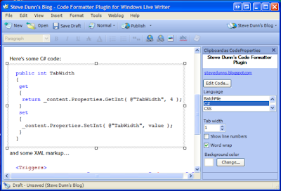

I'm quite new to blogging and have recently discovered Windows Live Writer. I've downloaded various plugins for code formatting but none provided me with what I wanted:

- The ability to format the code 'live'
- The ability to wrap lines
- The ability to change the background color
- The ability to just quickly paste what's in the clipboard as code

The plugin I implemented formats and highlights code and also does all the above. Here's a screen shot of it in use:

  

  

Here you can see that the content editor on the right can change the tab width, background color, language, and line numbers.

Below are some sample of code used with the plugin.

**Here's some C# code:**

public int TabWidth  
  
{get  
  
{  
  
return \_content.Properties.GetInt( @"TabWidth", 4 );  
  
}set{  
  
\_content.Properties.SetInt( @"TabWidth", value );  
  
}  
  
}  
  
  

  
  

  
  

**and some XML markup...**

  

<Triggers\>  
  
<KeyPressTrigger Key\="PropertyListTrigger" Character\=" "\>  
  
<KeyPressTriggerValidStates\>  
  
<KeyPressTriggerValidState State\="PropertyState" />  
  
</KeyPressTriggerValidStates\>  
  
</KeyPressTrigger\>  
  
<KeyPressTrigger Key\="ValueListTrigger" Character\=" "\>  
  
<KeyPressTriggerValidStates\>  
  
<KeyPressTriggerValidState State\="ValueState" />  
  
</KeyPressTriggerValidStates\>  
  
</KeyPressTrigger\>  
  
</Triggers\>  
  
  

  
  

  
  

I've made available the [source](http://files.dunnhq.com/CodeFormatterPluginSource.zip) and the [binaries](http://files.dunnhq.com/CodeFormatterPluginBinaries.zip) for this plugin.

  
  

To use it, extract the binaries to Windows Live WriterPlugins and run WLW. The source is in C# 2.0 and comes with a Visual Studio 2005 solution.

  
  

Note that the [.NET 2.0 Framework](http://www.microsoft.com/downloads/details.aspx?FamilyID=0856eacb-4362-4b0d-8edd-aab15c5e04f5&displaylang=en) must be installed before this plugin will work.

  
  

## Going forward

  
  

I plan to put this plugin onto [CodePlex](http://codeplex.com/) (if they let me!). I also plan on making a few additions to the defaults via the Options screen. New languages can easily be added too thanks to the great [ActiPro Code Highlighter](http://www.actiprosoftware.com/Products/DotNet/Default.aspx). I'd also like to thank Christophe De Baene for his syntax highlighting tool. It's a great plugin and also helped me understand how to use the ActiPro control.

  
  

Please let me know if you'd like to contribute on CodePlex or if there are any features you'd like to see at steve at dunnhq d.o.t. com
