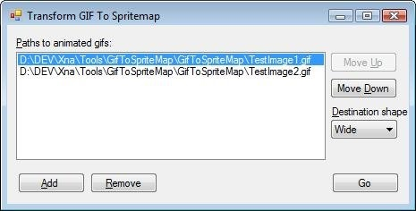

I'm having a lot of fun playing around with the XNA development kit. One day I'll get around to learning 3D but for now I'm still having too much fun with sprites! I wanted a tool that took an animated GIF and produced a spritesheet (a bitmap with each frame of the GIF).

From this:

I couldn't find a tool forthis (although I'm sure they exist), so I did my own and uploaded it to my [tools page](http://dunnhq.com/tools "Steve Dunn's Tools")

