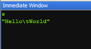
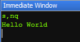
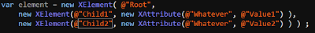
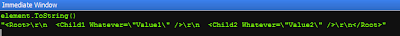
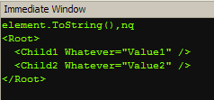

Normally, when you display values in the Visual Studio debugger, you get formatting (quotes, tabs etc.) included. For instance, if you've got string s = "Hello\[tab\]World"; then hovering over s in the debugger displays "HellotWorld". If you wanted to copy a value value to the clipboard (maybe because you landed on an exception and you want to send the error to the idiot that caused it your fellow colleague), you'd probably right click on the value and select 'copy value'. This copies the value to the clipboard. Another way is to use the immediate window. Using the example above, typing 's' in the immediate window would produce:

 

To get rid of formatting (the quotes and the control characters), use the ,nq option:

 

This is useful in itself, but it really becomes invaluable if you want to show some XML. With the magical ,nq switch, the following code: 

produces the following output in the immediate window: 

Pretty useless, but if you add ,nq, you get: 

Much nicer.

nq stands for nice'n quick, because it doesn't waste time writing quotes.

Probably.
