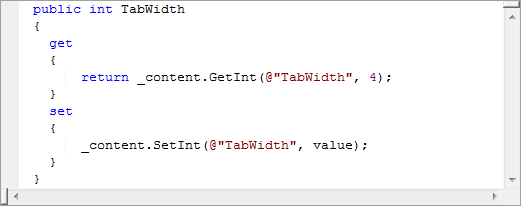

Version 2.0 of the Code Formatter Plugin for [Windows Live Writer](http://download.live.com/writer) is now available.

New in this version is the ability to use different formatting engines – in this version: [ActiPro](http://www.actiprosoftware.com/Products/DotNet/WindowsForms/SyntaxEditor/Default.aspx) and [SyntaxHighlighter 2.0](http://code.google.com/p/syntaxhighlighter/)

Also new is the ability to output either formatted code as text or as a bitmap.

> A massive thank you to [ActiPro](http://www.actiprosoftware.com/Default.aspx) for donating the [ActiPro Syntax Editor](http://www.actiprosoftware.com/Products/DotNet/WindowsForms/SyntaxEditor/Default.aspx) component – **the** best code editor available!

If you’re reading this in an aggregator, the following code snippets may look unformatted (apart from the bitmap), but if you’re not, then it should be all nicely formatted.

Here’s some output from ActiPro as text:

<div style="padding-bottom: 0px; margin: 0px; padding-left: 0px; padding-right: 0px; display: inline; float: none; padding-top: 0px">```
<pre style="background-color:#FFFFFF;;overflow: auto;"><span style="color: #0000FF;">public</span><span style="color: #000000;"> </span><span style="color: #0000FF;">int</span><span style="color: #000000;"> TabWidth
{
  </span><span style="color: #0000FF;">get</span><span style="color: #000000;">
  {
      </span><span style="color: #0000FF;">return</span><span style="color: #000000;"> _content.GetInt(</span><span style="color: #800000;">@"</span><span style="color: #800000;">TabWidth</span><span style="color: #800000;">"</span><span style="color: #000000;">, </span><span style="color: #800080;">4</span><span style="color: #000000;">);
  }
  </span><span style="color: #0000FF;">set</span><span style="color: #000000;">
  {
      _content.SetInt(</span><span style="color: #800000;">@"</span><span style="color: #800000;">TabWidth</span><span style="color: #800000;">"</span><span style="color: #000000;">, value);
  }
}</span>
```

</div>Here it is again as a bitmap:

[](/wp-content/uploads/2009/03/image_thumb-5B3-5D.png)

and here it is using SyntaxHighlighter 2.0

<div style="padding-bottom: 0px; margin: 0px; padding-left: 0px; padding-right: 0px; display: inline; float: none; padding-top: 0px">```
public int TabWidth
{
  get
  {
      return _content.GetInt(@"TabWidth", 4);
  }
  set
  {
      _content.SetInt(@"TabWidth", value);
  }
}
```

</div>[Please feel free to read more and download it.](http://stevedunns.googlepages.com/codeformatterforwindowslivewriter)

<div class="sfsi_Sicons" style="width: 100%; display: inline-block; vertical-align: middle; text-align:left"><div style="margin:0px 8px 0px 0px; line-height: 24px"><span>Please follow and like us:</span></div><div class="sfsi_socialwpr"><div class="sf_subscrbe" style="text-align:left;float:left;width:64px">[](http://www.specificfeeds.com/widgets/emailSubscribeEncFeed/ZGtRQ2N4YUkxenJ6TjgzTy9FZTZGOVlUampBalh0Tk05THhhblhmbDRkb2xlM3YxSjJmQ2puZlhkODJzNmNaVzFMZUJvY3ovZkJzRldLdHVicHJwamNaaUZ5UXJqOFROOW5PV2pDMzBGZjNLSHo3aloyRTlJdkhJRDdWK0FNT3B8c3VkUm1QVE45WHJ3U0FIZVBnWG9lUUFXWWJvVDdIOXBsL2Q2NlduWE01dz0=/OA==/)</div><div class="sf_fb" style="text-align:left;width:98px"><div action="like" class="fb-like" data-layout="button" data-share="true" href="" send="false" showfaces="false" width="180"></div></div><div class="sf_twiter" style="text-align:left;float:left;width:auto">[](http://twitter.com/share)</div><div class="sf_pinit" style="text-align:left;float:left;line-height: 20px;width:47px">[](https://www.pinterest.com/pin/create/button/?url=&media=&description=)</div><div class="sf_google" style="text-align:left;float:left;max-width:62px;min-width:35px;"><div class="g-plusone" data-annotation="none" data-href="" data-size="large"></div></div></div></div>