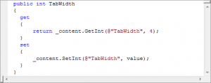

Version 2.0 of the Code Formatter Plugin for [Windows Live Writer](http://download.live.com/writer) is now available.

New in this version is the ability to use different formatting engines – in this version: [ActiPro](http://www.actiprosoftware.com/Products/DotNet/WindowsForms/SyntaxEditor/Default.aspx) and [SyntaxHighlighter 2.0](http://code.google.com/p/syntaxhighlighter/)

Also new is the ability to output either formatted code as text or as a bitmap.

> A massive thank you to [ActiPro](http://www.actiprosoftware.com/Default.aspx) for donating the [ActiPro Syntax Editor](http://www.actiprosoftware.com/Products/DotNet/WindowsForms/SyntaxEditor/Default.aspx) component – **the** best code editor available!

If you’re reading this in an aggregator, the following code snippets may look unformatted (apart from the bitmap), but if you’re not, then it should be all nicely formatted.

Here’s some output from ActiPro as text:

public int TabWidth
{ get { return \_content.GetInt(@"TabWidth", 4);
  } set {
      \_content.SetInt(@"TabWidth", value);
  }
}

Here it is again as a bitmap:

and here it is using SyntaxHighlighter 2.0

public int TabWidth
{
  get
  {
      return \_content.GetInt(@"TabWidth", 4);
  }
  set
  {
      \_content.SetInt(@"TabWidth", value);
  }
}

[Please feel free to read more and download it.](http://stevedunns.googlepages.com/codeformatterforwindowslivewriter)
