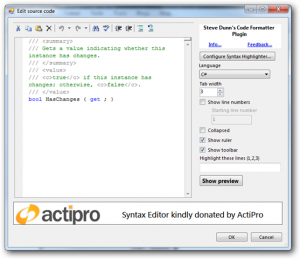
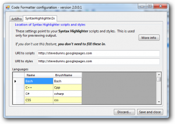
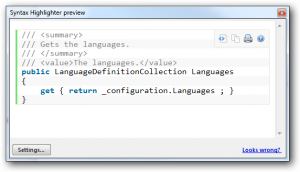

Version 2.0.0.1 of the [Code Formatter Plugin](http://stevedunns.googlepages.com/codeformatterforwindowslivewriter) is now available.

New in this version:

1. Enhanced support for [Syntax Highlighter 2x](http://alexgorbatchev.com/wiki/SyntaxHighlighter)  
    You can now specify things such as [tab size](http://alexgorbatchev.com/wiki/SyntaxHighlighter:Demo:tab-size), [show ruler](http://alexgorbatchev.com/wiki/SyntaxHighlighter:Demo:ruler), [collapse](http://alexgorbatchev.com/wiki/SyntaxHighlighter:Demo:collapse),  [show toolbar](http://alexgorbatchev.com/wiki/SyntaxHighlighter:Demo:toolbar), [show line numbers](http://alexgorbatchev.com/wiki/SyntaxHighlighter:Demo:gutter), [starting line number](http://alexgorbatchev.com/wiki/SyntaxHighlighter:Demo:first-line), and [highlighting specific line numbers](http://alexgorbatchev.com/wiki/SyntaxHighlighter:Demo:highlight).   
    
2. Configuration screens for the different providers  
      
    You can now add and remove languages and generally configure each provider.  You can also edit the files manually – they are called SyntaxHightlighter2xConfiguration.xml and ActiProConfiguration.xml.  They are located in the Plugins folder.
3. Preview window for Syntax Highlighter formatted code.  
       
    This was added because the Preview tab in Windows Live Writer doesn’t include the scripts and styles used in your blog engine’s templates and hence previewing Syntax Highlighted code means it looks plain.  Click the Show Preview button to see this window.

[Code Formatter Plugin home-page](http://stevedunns.googlepages.com/codeformatterforwindowslivewriter)  
[Direct download link](http://stevedunns.googlepages.com/CodeFormatterPlugin2.0.0.1.zip)
