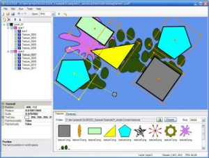
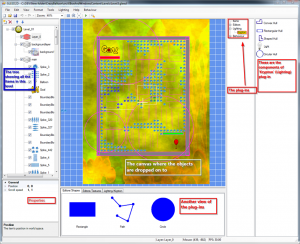

I’ve spent some time over the Summer and Autumn of 2011 rewriting the [Gleed 2D tool](https://github.com/SteveDunn/Gleed2D/wiki).  This is a tool for editing levels for 2D games and is a very popular tool in the XNA community for games running on XBox and Windows Phone.

Most of the changes in the new version are under-the-hood.  The biggest change has been to make it have a plug-in architecture.  There has also been a few UI changes though; here’s some screen-shots.

##### The original tool before being re-written:

##### and here’s the new version:

##### 

The main reason for rewriting the tool was that I wanted to add more features to it but found that it wasn’t easy.  It wasn’t easy because it was originally written to just handle the basics needed for creating and editing levels.

The features that I wanted to add were for the next version of [my game](http://marketplace.xbox.com/en-US/Product/Crazy-Balloon-Lite/66acd000-77fe-1000-9115-d80258550914) ([video here](http://www.youtube.com/watch?v=-H3099NgokM)). I wanted to include lighting and shadows and  I wanted to design these on the canvas.

Instead of shoe-horning my changes into the original Gleed 2D source, I decided it’d be best to rewrite it and change it to a plug-in based tool.

So, now everything is a plug-in.  The basic shapes (rectangle, circle, path) and textures are now plug-ins.  Lighting (lights and shadows) is now a plug-in.  There’s also a plug-in for simple ‘behaviour’.

Here’s a quick video showing how to use the basic shapes and textures:

Basic shapes and textures

Here’s a short video showing lighting:

Lights and shadows

and lastly, here’s a short video showing simple behaviours:

Simple behaviours

The tool is still currently a bit rough.  There’s various [bugs](https://github.com/SteveDunn/Gleed2D/issues) that need to be fixed, but none of them stop the tool from doing what it was designed to do.  The project is now quick big, so I’m hoping that the community will jump in and add/fix stuff.  I’d like to see plug-ins for physics and particle systems.

Feel free to download the source and play around.
