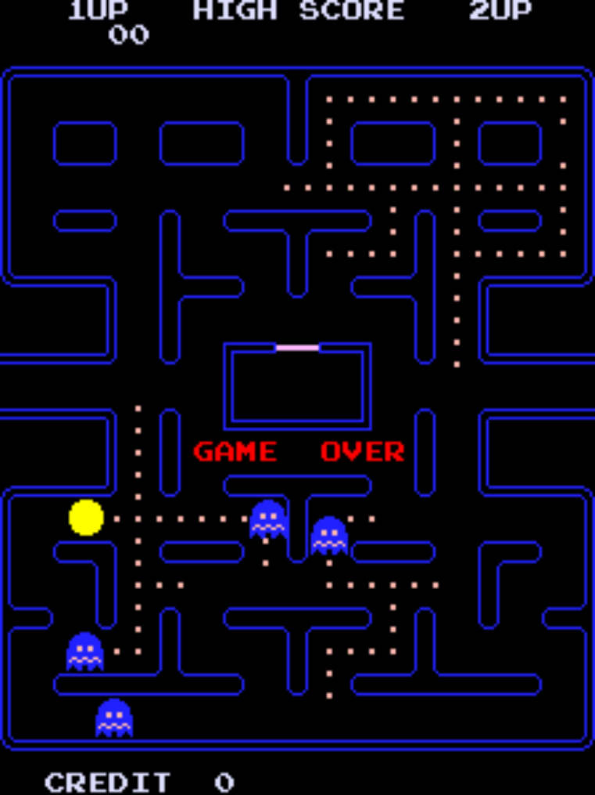
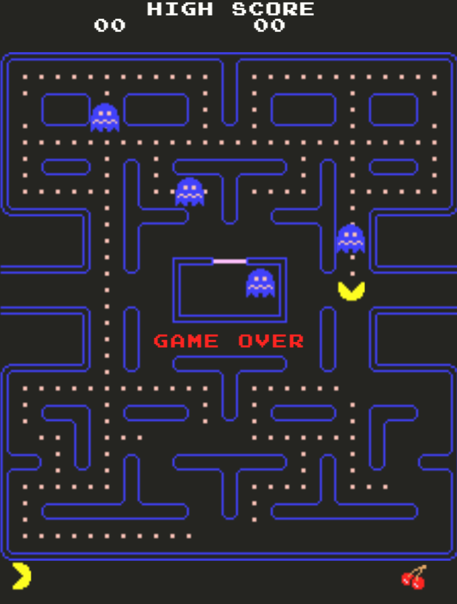
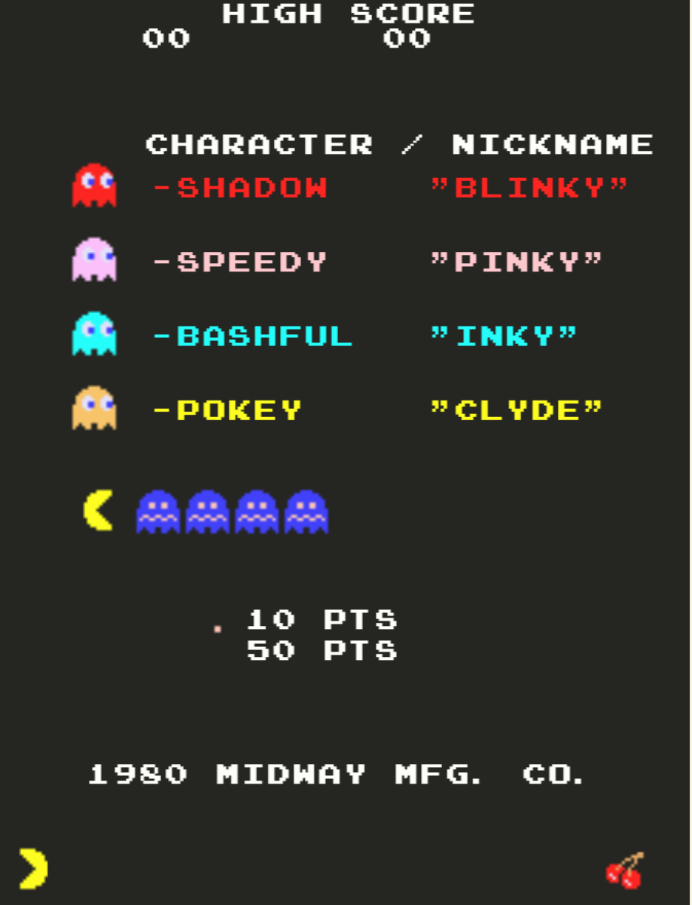
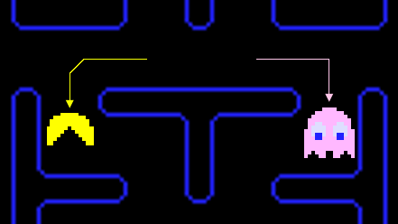

Want to learn a new programming language? Tired of the usual Line-of-Business tutorials? Then write a game! I’ve always said that the best way to learn a new language is to write a game with it. You’ll come across many problems when writing a game that you just won’t experience by writing an app that selects product items from a customer’s order.

That’s what I did recently when I wanted to learn TypeScript. I decided to write a [web-based version of PacMan.](http://pacman.backroomsoftware.com/) This post describes a bit about my goals. There’s nothing technical here; I may, at some point, describe the internals of the game and share the code.

**\*\*Update August 2017 – [source code published and internals described](http://blog.dunnhq.com/index.php/2017/08/03/pacman-dissected/)\*\***

My goals were to learn TypeScript and end up with a game that looked and played similar the original.

Here’s some comparison screenshots:

Arcade (Mame)

TypeScript

Arcade  
TypeScript  

Whilst learning the language, I didn’t want the overhead of also learning a game framework, so I chose to use the [HTML canvas](https://www.w3schools.com/graphics/canvas_intro.asp) directly. This worked out well as the canvas is very simple to use.

The feedback cycle with the canvas is really quick: do the code changes and refresh the browser to see the results.

I used a combination of Visual Studio Code &amp; node, and Visual Studio (2017) with IIS. I found debugging with Visual Studio 2017 easier than with Visual Studio Code (and of course, I also had ReSharper which works quite nicely with TypeScript although it’s not quite as fast and robust as it is with C#).

I found it quite easy to pick up TypeScript, probably because of its similarities with other C based languages. Like most languages, it’ll probably take years of use to master all of its nuances (my familiarity with the nuances of C# came from using it for years, and also from reading the fantastic [More Effective C#](https://www.amazon.co.uk/d/Books/More-Effective-Specific-Software-Development/0321485890)).

In fact, I found that it was very quick and easy to get up and running in TypeScript. This was both good and bad: good because I could concentrate on the game more and worry less about the language, and bad because I could concentrate on the game more and worry less about the language!

There’s a [fair bit to PacMan](http://www.gamasutra.com/view/feature/132330/the_pacman_dossier.php?page=1) and I wanted mine to be as close to the original as possible. This included things such as:

- **Everything has a different speed** and those speeds vary depending on level (and where you are in the level). PacMan travels at a different speed to the ghosts (initially, a very small difference), but later levels the difference increases. PacMan’s speed changes when he’s eating pills, which is barely noticeable unless a ghost is 5 pixels from your rear!
- **Cornering –** Related to the different speeds of things is the technique of ‘cornering’: PacMan can gain a very slight speed increase over the ghosts by selecting the direction a couple of pixels before the turn:

This is very subtle but is critical in later levels; to evade faster ghosts, head to as many corners as possible until the ghost pattern changes (see below) – each corner gives PacMan a couple of pixels advantage of the ghost

- **Ghost patterns**: ghosts are either chasing PacMan or returning to their ‘home corner’. Every level has a different duration to the patterns. I used [this page for all the timing](http://www.designoriented.net/blog/2015/06/30/2015630pac-man-design-variables-of-difficulty/)s in the game and [this page](http://gameinternals.com/post/2072558330/understanding-pac-man-ghost-behavior) to understand where the ghosts should go.
- **BUGS!** There are a few bugs in the original PacMan. As far as I know, I replicated all but one bug ([the kill screen bug](https://tcrf.net/Bugs:Pac-Man_(Arcade)#Level_256_Split_Screen)) (but I’m sure I introduced a few of my own to make up for it!). Bugs deliberately programmed in include the [ghost house bug](https://youtu.be/GI_kHYAUZOU) (where it’s possible to keep 3 ghosts from entering the maze for the whole level), and the bug where ghosts can (very rarely) [change direction just before they eat PacMan](http://donhodges.com/pacman_pinky_explanation.htm).
- **Ghost eyes**: ghost’s eyes look at where they’re going next. If they’re heading for a T-junction, they’ll either look left or right just before they get there. If you’re very quick, you can use this to your advantage. This is very subtle. I’ve played PacMan for years and only recently discovered this.
- **Cutscenes**: These are [intermission screens](https://www.youtube.com/watch?v=v8BT43ZWSTY) that appear after certain levels. They tell a ‘story’ that reveals the true identity of the ghosts!

I found that the game itself was only half the work. I wanted it to run on as many platforms and devices as possible (PCs, phones, tablets). A fair amount of work, after the game was finished, went into things like:

- **The loading screen** to show the progress of script and asset loading
- **Audio issues** – sound played on the PC but didn’t play on mobile devices. I ended up using the super [Howler library](https://howlerjs.com/)
- **Control Panel** – needed a control panel where users could ‘insert coins’ and select the number of players by clicking/touching (during development it was all keyboard based)
- **Touch/swipe** – needing to handle touch/swipe correctly for tablets and phones
- **Sound** – not playing on mobile devices until touched

Overall, I think it was a good idea to write a game to learn TypeScript. Aside from the extra tasks involved after finishing writing the game, it was a quick way to learn the language with the added bonus of being able to visualise progress. [Click here to play](http://pacman.backroomsoftware.com/).