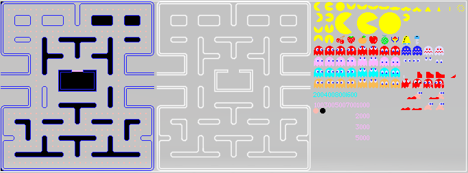
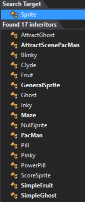
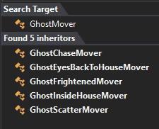

<div class="dropshadowboxes-container dropshadowboxes-center " style="width:100%;"><div class="dropshadowboxes-drop-shadow dropshadowboxes-rounded-corners dropshadowboxes-inside-and-outside-shadow dropshadowboxes-lifted-both dropshadowboxes-effect-default" style="width:auto; border: 1px solid #dddddd; height:; background-color:#ffffff;    "> “If Pac-Man had affected us as kids, we’d all be running around in dark rooms, munching pills and listening to repetitive electronic music” </div> </div>*Markus Brigstocke*

In my previous post, I wrote about [learning TypeScript by writing a game](http://blog.dunnhq.com/index.php/2017/07/13/learning-typescript-by-writing-a-game/).

The game I chose was Pacman ([play it here](http://pacman.backroomsoftware.com/)).

I never intended to make the source code available, but a few people asked for it, so I’ve tidied it up a bit and [put it on GitHub](https://github.com/SteveDunn/Pacman) (it’s far from tidy though, so go easy – plus it’s my first attempt at TypeScript!)

I’ve described the major bits of the code below. I’ve described:

- the startup – how scripts and assets are loaded
- the game-loop – what bits of code are called 60 times per second
- the game flow – how the code flows from one screen to another
- the graphics – spritesheets, sprites, and Canvas and how they fit together
- the maze – how things interact with the maze
- ghosts – most of the logic in the game is associated with the ghosts
- timing and difficulty – getting the game to play like the real arcade game

If there’s anything I’ve missed, please let me know.

I hope you find this useful. Please be aware that **this is not a shining example of TypeScript or the best patterns to use in TypeScript**. The style leans heavily towards C# as that’s my day-to-day language. It barely scrapes the surface of TypeScript features and I’m sure there are many things in it that could be made more elegant (*readable*) by using other TypeScript features. **I’d love to get feedback on the code as I’d like to evolve it over time.** So please free to provide feedback, pull-requests, etc. etc.

- - - - - -

Build and Run
-------------

The following should download and run the game (assuming you’ve got git and npm installed):

```
<pre class="lang:sh decode:true ">git clone https://github.com/SteveDunn/Pacman.git
cd pacman
npm install
tsc
start http://localhost:8080
```

Game Startup
------------

index.html loads the JavaScript scripts for howler (sound), hammer (touch), the loading screen, the control panel, and require.js.

When the page loads, it loads all of the sound files and then all of js files. require.js fires an event (`load`), when a script is loaded. We subscribe to this event and tell the loading screen that a script is loaded (`loadState.scriptLoaded(moduleName)`).

The main game is held within a div named `gameDiv`. Within that div is a `canvas`:

```
<pre class="lang:xhtml decode:true"><!--ideal canvas size = 672/944 (0.711 aspect ratio) (or 224 x 314) -->
<div id="gameDiv" style="opacity: 0.75;">
    <canvas id="gameContainer" width="672" height="944">
        Your browser does not support the HTML5 canvas tag.
    </canvas>
</div>
```

The next bit then instantiates the `Engine`:

```
<pre class="lang:xhtml mark:4 decode:true">require(["js/Engine", "js/GameStorage"],
function (pacManModule) {
    loadState.scriptsFinishedLoading();
    var engine = new pacManModule.Engine();
});
```

`Engine` (in Engine.ts) is a small type which handles:

- running the game-loop
- handling ‘credits’ (when 1 or 2 player buttons are pressed)
- showing/hiding the control panel

Game Loop
---------

The game-loop runs 60 times per second via a call to [`window.requestAnimationFrame`](https://developer.mozilla.org/en-US/docs/Web/API/window/requestAnimationFrame)

The game-loop updates and draws everything (60 times per second). It calls `MainWindow.Update` (MainWindow.ts) with the time elapsed since the last call. The time elapsed is important as it allows timers to be run accurately. MainWindow is the, er, main window. It handles:

- updating the **current act (see below)**
- drawing the current act
- updating and drawing the score and status panels
- handling game events, such as ‘pacManEaten’, ‘ghostEaten’ etc.

Game Flow
---------

Everything in the game is an `Act`:

```
<pre class="lang:js decode:true">import { Canvas, GameContext } from "../Core/_exports";

import { ActUpdateResult } from "./ActUpdateResult";

/**
* An 'act' is something that's run in a loop. The main window continaully updates and draws whatever
* the 'current act' is. Acts are things such as DemoAct, GameAct, GameOverAct etc.
*/
export abstract class Act {
    abstract update(context: GameContext): ActUpdateResult;
    abstract draw(canvas: Canvas): void;
    abstract get nextAct(): Act;
}
```

Here are the different `Act`s:


The welcome screen (or the ‘attract screen’ as they call it in arcade circles) is called the `AttractAct`. You can see it being set as the main Act in MainWindow.ts:

```
<pre class="lang:js decode:true">MainWindow.currentAct = new AttractAct();

// POINTER: You can change the starting Act by using something like:
//MainWindow.currentAct = new TornGhostChaseAct(new AttractAct());

```

When the `update` method returns `Finished`, the game-loop starts to run the `Act` returned by `nextAct`.

Graphics
--------

The graphics are drawn onto an HTML `Canvas`. A [sprite-sheet](https://gamedevelopment.tutsplus.com/tutorials/an-introduction-to-spritesheet-animation--gamedev-13099) is loaded in `index.html:`

```
<pre class="lang:xhtml decode:true">
```

It looks like this:



It contains all of the graphics in one image. The sprites then reference a particular rectangle of this image and are drawn on the canvas. All sprites derive from `Sprite`:

```
<pre class="lang:js decode:true">export abstract class Sprite {

    loadContent(): void { // nothing 
    };

    abstract get position():Point;

    abstract update(context: GameContext): void;

    abstract draw(canvas: Canvas): void;

    abstract get origin(): Point;

    abstract get size(): Vector2D;

    abstract get spriteSheet(): HTMLImageElement;

    abstract get spriteSheetPos(): Point;
}
```



Each sprite has the following facets:

- `position` specifies where in the ‘game world’ the sprite currently is
- `spriteSheetPos` specifies the point in the sprite-sheet where the image for this sprite begins
- `origin` specifies the offset from the top left of the sprite that acts as the origin. The origin is used to calculate the top left position of the sprite and can be used for rotation (rotating something whos origin is top left will have a different effect that animating something whos origin is center)
- `size` specifies the pixel extent of the sprite. Everything drawn in this game is zoomed in by 3 times, so the size here is the pixel size, and not the output ‘screen size’

The Maze
--------

The maze (as shown above) is drawn to the canvas every frame. The ‘pills’ (normal pills and ‘power pills’) are removed from maze (well, a copy of each as there’s one for each player) when the pill is eaten.

The maze is broken down into ’tiles’ that are 8×8 pixels in size. Sprite positions are converted to the associate ’tile’. The game then refers to a lookup that says what’s in the current tile. The lookup looks like this:

```
<pre class="lang:js decode:true">private static readonly map: string[] = [
        // 0,0                     29,0
        "                             ",
        " oooooooooooo  oooooooooooo  ",
        " o    o     o  o     o    o  ",
        " *    o     o  o     o    *  ",
        " o    o     o  o     o    o  ",
        " oooooooooooooooooooooooooo  ",
        " o    o  o        o  o    o  ",
        " o    o  o        o  o    o  ",
        " oooooo  oooo  oooo  oooooo  ",
        "      o     +  +     o       ",
        "      o     +  +     o       ",
        "      o  ++++++++++  o       ",
        "      o  +        +  o       ",
        "      o  +        +  o       ",
        "++++++o+++        +++o+++++++",
        "      o  +        +  o       ",
        "      o  +        +  o       ",
        "      o  ++++++++++  o       ",
        "      o  +        +  o       ",
        "      o  +        +  o       ",
        " oooooooooooo  oooooooooooo  ",
        " o    o     o  o     o    o  ",
        " o    o     o  o     o    o  ",
        " *oo  ooooooo++ooooooo  oo*  ",
        "   o  o  o        o  o  o    ",
        "   o  o  o        o  o  o    ",
        " oooooo  oooo  oooo  oooooo  ",
        " o          o  o          o  ",
        " o          o  o          o  ",
        " oooooooooooooooooooooooooo  ",
        "                             "
    ];
```

- `o` represents a cell containing a pill
- `*` represents a cell containing a power-pill
- `+` represents a cell containing nothing
- `[space]` represents a wall

A tile is represented by the `Tile` class. Some of the main methods on here are:

- `isInCenter` – is the sprite’s position near the center of the tile?
- `nextTile` – it is common to get the next tile, based on the direction that an actor is headed
- `nextTileWrapper` – the next tile, but taking into account ‘wrapping’ (the two tunnels at either side of the maze)

Ghosts
------

Ghosts move around the maze and either chase pacman or run away from him. Here’s the various states of a ghost:

```
<pre class="lang:js decode:true">export enum GhostState {
    // heading towards pacman or their home corner (scatter)
    Normal,

    // blue - running away from pacman (in a random pattern)
    Frightened,

    // heading back to the 'House'
    Eyes
}
```

The `state` of a ghost can differ from the ‘movement mode’ of a ghost:

```
<pre class="lang:default decode:true">export enum GhostMovementMode {
    Undecided,
    // the ghost is chasing pacman
    Chase,
    // the ghost is heading back to his 'home corner'
    Scatter,

    // the ghost is heading back to the house (after he's been eaten)
    GoingToHouse,

    // the ghost is in the house
    InHouse,

    // the ghost is blue
    Frightened
}
```

I mentioned that the ‘ghost state’ and ‘movement mode’ can differ; an example is that a ghost can be ‘blue’ (Frightened) while still being in the ghost house

There are a number of types responsible for moving ghosts. They all implement `GhostMover`:



The general logic of a ghost comprises of ‘head to the home corner for `X` seconds, chase pacman for `X` seconds’. The time spent in each phase varies throughout the level. Each level specifies different patterns.

Timing and Difficulty
---------------------

Getting the difficulty to match that of the arcade game was tricky. There are many variables used throughout each level. These variables are described in the type `LevelProps`:

```
<pre class="lang:js decode:true ">export class LevelProps {
    constructor(
        public readonly introCutScene: IntroCutScene,           

        public readonly fruit: FruitItem,                       
        public readonly fruitPoints: number,                    

        public readonly pacManSpeedPc: number,                  
        public readonly pacManDotsSpeedPc: number,              

        public readonly ghostSpeedPc: number,                   
        public readonly ghostTunnelSpeedPc: number,             

        public readonly elroy1DotsLeft: number,                 
        public readonly elroy1SpeedPc: number,                  
        public readonly elroy2DotsLeft: number,                 
        public readonly elroy2SpeedPc: number,                  

        public readonly frightPacManSpeedPc: number,            
        public readonly frightPacManDotSpeedPc: number,         

        public readonly frightGhostSpeedPc: number,             
        public readonly frightGhostTime: number,                
        public readonly frightGhostFlashes: number) {           
        }                                                               
}
```

At a glance, there are different speeds for:

- Pacman – depending on whether he’s eating pills or he’s in an empty cell (a very minor difference, but it makes all the difference if you’ve got a ghost 2 pixels away!)
- ghosts – depending on whether they’re on cells that contain pills or empty cells, and also whether they’re ‘frightened’ (blue)
- the duration the ghosts are blue for (in later levels, this is one frame (1/60th of a second!))
- ‘[Cruise Elroy](https://www.destructoid.com/blinky-inky-pinky-and-clyde-a-small-onomastic-study-108669.phtml)‘ speed – Blinky is the only ghost that has different speeds throughout the level
- tunnel speed – ghosts travel slower through tunnels

There’s a rather large array created in `LevelStats` that contains all of these variables for the first 21 levels.