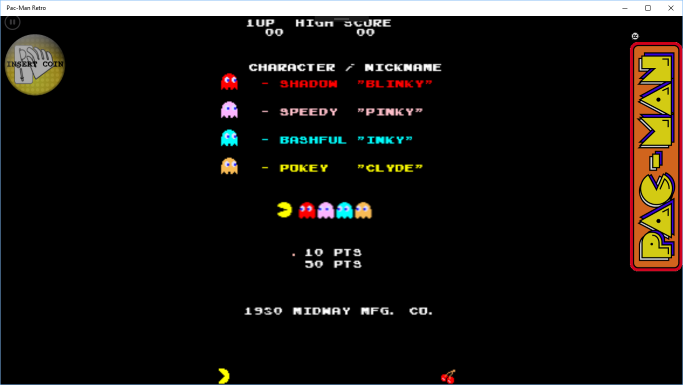
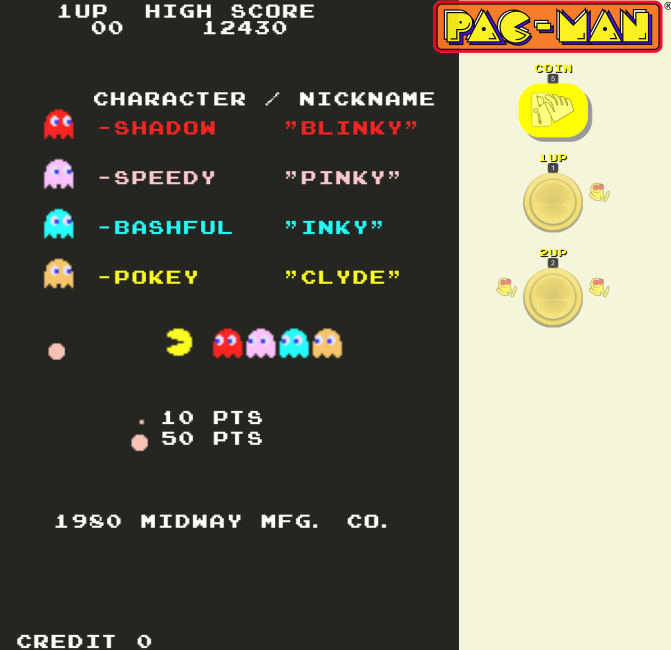
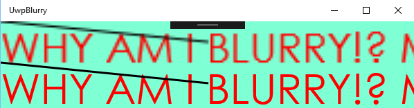
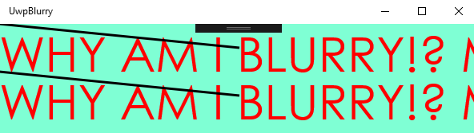

Mine were until I discovered new COMMON SENSE!®

*TL;DR: I did something stupid and realised my mistake – what follows is mainly for future reference and for those that are making the same mistake.*

[Win2D](https://github.com/Microsoft/Win2D) is great! So is the concept of [UWP](https://docs.microsoft.com/en-us/windows/uwp/get-started/whats-a-uwp) and the Windows Store. It means you can write a game for the Windows Store (for Windows 10), and with some minimal work, it can run on the XBox One (since that’s based on Windows 10 too).

So, I set about converting Pac-Man that I’d [written in TypeScript](http://blog.dunnhq.com/index.php/2017/08/03/pacman-dissected/) ([*play it here*](http://pacman.backroomsoftware.com)), into C# and publishing it on the Windows Store.

Here’s the opening screen – note the text looks naff and the sprites have lost their *intentionally pixelly look*:

… compared to the TypeScript version:

I spent quite some time trying to fix this – thinking it was some nuance of Win2D and offscreen bitmaps. I didn’t get anywhere, so I set out to create a small reproducible project that I could use in a StackOverflow question (*as an aside, I often find that just typing a StackOverflow question creates enough clarity of the problem that the answer just magically appears – as was the case here!*). So with just a few lines of code, I had this monstrosity:

Here’s the relevant bit of the drawing code:

<noscript>View the code on [Gist](https://gist.github.com/SteveDunn/a87d72e0180bf5dd4222ed26d01b7e86).</noscript>
Even though I know how tolerant the StackOverflow community is (`</sarcasm>`), for completeness and to show that I did my homework before asking, I tried the same drawing (`DrawImage`) with multiple overloads and included a screen-shot for each.

So, I’m about 45 minutes into writing the StackOverflow question, and then it struck me:

**I’m only scaling the main drawing session; what I really wanted to do is scale the off-screen drawing session too*:*** in Win2D, when drawing, each instruction is queued and then blitted to the GPU asynchronously, so my flow is:

1\. Scale up the main `DrawingSession` to make things looks bigger  
2\. Create an offscreen `DrawingSession`  
3\. Draw text and a line to the offscreen session  
4\. Draw the offscreen session **to** the main drawing session  
5\. Draw text and a line to the main session

Essentially, the offscreen canvas created in **step 2** has its instructions **drawn at 1x scale** but **blitted at 4x scale**, rather than the instructions being drawn at 4x scale and blitted at 1x scale.

Here’s the corrected code:

<noscript>View the code on [Gist](https://gist.github.com/SteveDunn/5247b41cad036cb05885d5a3df0f5f49).</noscript>
… which produces this beautiful output:

Once common sense prevailed, I discarded the StackOverflow question, but put up this post for anyone who might see similar issues in their Win2D app.

Please follow and like us:

