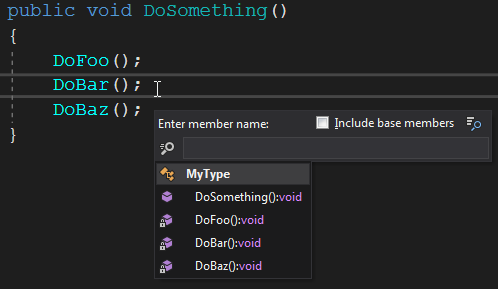
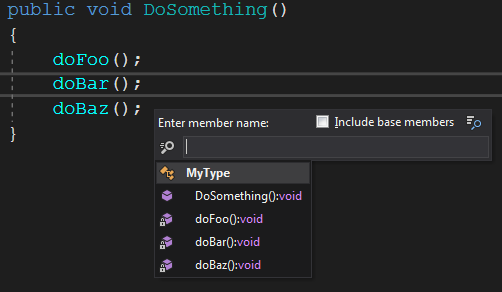

Ever thought about why the default C# convention **differentiates** between `private` and `public` fields: privates being `_camelCased`and publics being `PascalCased`?  
Ever wondered why that same default convention **doesn’t differentiate** between private and public **methods**?

My convention, like the Java convention, is **to make that differentiation** between private and public methods. I quite often have this discussion when I join a new team, so I thought I’d write it up.

- - - - - -

I find it useful to `camelCase` private methods to differentiate them from public methods.

**Why would you want to differentiate them?** For the same reason you want to differentiate private fields from other things in your type.

The change is subtle but useful. It’s a visual aid to the reader that the method is private.

Consider the following method: it calls three other methods:

```
<pre class="">public void DoSomething()
 {
    DoFoo();
    DoBar();
    DoBaz();
 }
```

Which method(s) out of `DoFoo()` `DoBar()` and `DoBaz()` are private?

**You can’t tell without going to** *(or peeking at)* **the definitions of each of those methods.**

Why is it important to know, at a glance, the accessibility of a method?

When you *land* in a new file, you’ve probably ended up in a public method and have got there from looking at a chain of other methods, probably in other types *(via Go To Definition for example)*.

Scanning through this method to see what other methods it calls should give you a quick overview of what it’s doing (or the behaviour it exposes). If you can see at a glance that it calls mostly private methods, then it **gives you more reassurance of the cohesiveness and quality of that type**.

If you can see that it calls other public methods, then you need to be aware of the **larger exposed area of the type**; maybe that type doesn’t conform to the Single Responsibility Principle *(granted, it may have multiple public methods that are overloads or named differently as they take different input but ultimately do the same thing)*.

Something I often do is to look at all the methods of a type. I often do this **to gauge the amount that’s exposed from the type** *(the less, the better, ideally **one method**)*.

Below is the visual difference between having the `DoXxx` methods `public` and `private` *(the popup is from using using <span style="color: #222222; font-family: Inconsolata, monospace;"><span style="background-color: #e9ebec;">Go to Member</span></span> in ReSharper)*

**with the 3 methods as public:**


**with the 3 methods as private:**



The differences are hard to notice. ReSharper has padlocks to signify privates

**with the 3 methods as private `camelCased`:**



T**he most striking visual clue is the different casing**.

The visual aid that different casing gives us is more pronounced in situations where there are no icons or other hints on the code; **such as in code reviews**.

Conclusion
==========

Different casing gives us a small but useful visual aid to the accessibility of a method. Accessibility is as important as to what the actual method does. We should use a convention to differentiate private methods just as we have a convention to differentiate private fields.

<div class="sfsi_Sicons" style="width: 100%; display: inline-block; vertical-align: middle; text-align:left"><div style="margin:0px 8px 0px 0px; line-height: 24px"><span>Please follow and like us:</span></div><div class="sfsi_socialwpr"><div class="sf_subscrbe" style="text-align:left;float:left;width:64px">[](http://www.specificfeeds.com/widgets/emailSubscribeEncFeed/ZGtRQ2N4YUkxenJ6TjgzTy9FZTZGOVlUampBalh0Tk05THhhblhmbDRkb2xlM3YxSjJmQ2puZlhkODJzNmNaVzFMZUJvY3ovZkJzRldLdHVicHJwamNaaUZ5UXJqOFROOW5PV2pDMzBGZjNLSHo3aloyRTlJdkhJRDdWK0FNT3B8c3VkUm1QVE45WHJ3U0FIZVBnWG9lUUFXWWJvVDdIOXBsL2Q2NlduWE01dz0=/OA==/)</div><div class="sf_fb" style="text-align:left;width:98px"><div action="like" class="fb-like" data-layout="button" data-share="true" href="" send="false" showfaces="false" width="180"></div></div><div class="sf_twiter" style="text-align:left;float:left;width:auto">[](http://twitter.com/share)</div><div class="sf_pinit" style="text-align:left;float:left;line-height: 20px;width:47px">[](https://www.pinterest.com/pin/create/button/?url=&media=&description=)</div><div class="sf_google" style="text-align:left;float:left;max-width:62px;min-width:35px;"><div class="g-plusone" data-annotation="none" data-href="" data-size="large"></div></div></div></div>