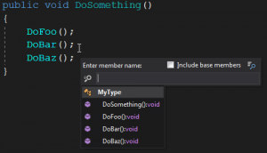
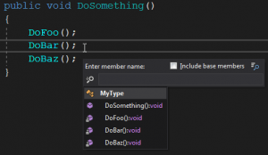
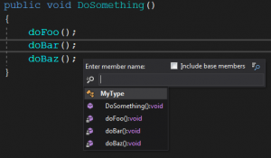

Ever thought about why the default C# convention **differentiates** between `private` and `public` fields:  privates being `_camelCased`and publics being `PascalCased`? Ever wondered why that same default convention **doesn't differentiate** between private and public **methods**?

My convention, like the Java convention, is **to make that differentiation** between private and public methods.  I quite often have this discussion when I join a new team, so I thought I'd write it up.

* * *

I find it useful to `camelCase` private methods to differentiate them from public methods.

**Why would you want to differentiate them?** For the same reason you want to differentiate private fields from other things in your type.

The change is subtle but useful. It’s a visual aid to the reader that the method is private.

Consider the following method: it calls three other methods:

public void DoSomething()
 {
    DoFoo();
    DoBar();
    DoBaz();
 }

Which method(s) out of `DoFoo()` `DoBar()` and `DoBaz()` are private?

**You can’t tell without going to** _(or peeking at)_ **the definitions of each of those methods.**

Why is it important to know, at a glance, the accessibility of a method?

When you _land_ in a new file, you’ve probably ended up in a public method and have got there from looking at a chain of other methods, probably in other types _(via Go To Definition for example)_.

Scanning through this method to see what other methods it calls should give you a quick overview of what it’s doing (or the behaviour it exposes). If you can see at a glance that it calls mostly private methods, then it **gives you more reassurance of the cohesiveness and quality of that type**.

If you can see that it calls other public methods, then you need to be aware of the **larger exposed area of the type**; maybe that type doesn’t conform to the Single Responsibility Principle _(granted, it may have multiple public methods that are overloads or named differently as they take different input but ultimately do the same thing)_.

Something I often do is to look at all the methods of a type. I often do this **to gauge the amount that’s exposed from the type** _(the less, the better, ideally **one method**)_.

Below is the visual difference between having the `DoXxx` methods `public` and `private` _(the popup is from using using Go to Member in ReSharper)_

**with the 3 methods as public:**

**with the 3 methods as private:**

The differences are hard to notice. ReSharper has padlocks to signify privates

**with the 3 methods as private `camelCased`:**

T**he most striking visual clue is the different casing**.

The visual aid that different casing gives us is more pronounced in situations where there are no icons or other hints on the code; **such as in code reviews**.

# Conclusion

Different casing gives us a small but useful visual aid to the accessibility of a method. Accessibility is as important as to what the actual method does. We should use a convention to differentiate private methods just as we have a convention to differentiate private fields.
