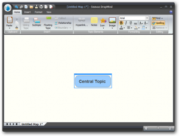
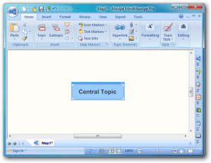

I’m a big fan of mind maps.  I use [MindManager](http://www.mindjet.com/), but there’s now an online Silverlight alternative from [DropMind](http://dropmind.com/). 

It’s currently in beta, so there’s a few things that need addressing to make it as nice to use as MindManager (such as keyboard navigation).  Despite this, it looks feature packed compared to other online mind mapping tools I’ve tried.

There’s also a desktop version.  It has none of the above keyboard problems.  It also looks and feels _very_ similar to MindManager:

**DropMind**

**MindManager**

It’s nice to see Silverlight apps like this.  I’d probably switch to it once all the glitches are resolved.  MindManager’s great, but it comes with a lot of fluff I don’t need, like Office integration and RSS features.
