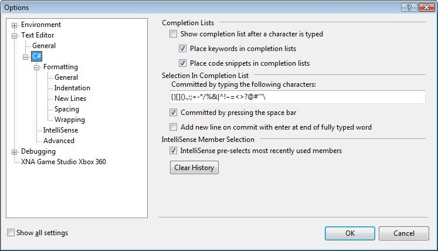
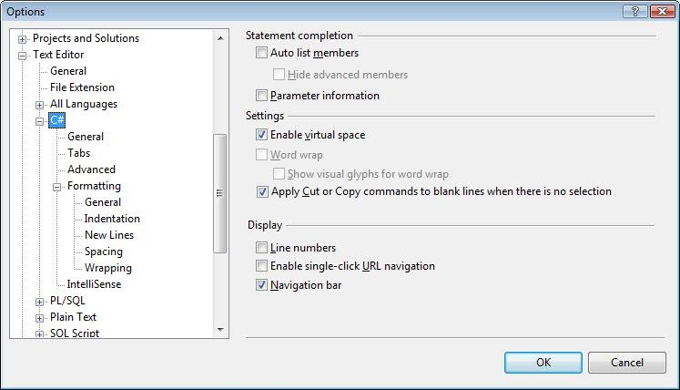

Microsoft recently released the [XNA](http://msdn.com/xna "MSDN XNA Site") toolkit for XBox 360 and PC games development.  The supported IDE for this is [Visual C# Express](http://msdn.microsoft.com/vstudio/express/visualcsharp/ "Visual C# Express"). 

I am quite picky about my development environment, for instance: I like the Consolas 12pt font;  I like 2 tab spaces instead of 4;  I like virtual space in the editor; etc. etc.

Visual Studio Express does not give the option to change tab size and virtual space settings so I immediately jumped into regedit and edited the values.  Then I thought that maybe I could export my settings from Visual Studio 2005 Professional and import them into Express.

This worked, with the exception of some command bar stuff that isn't supported in Express.  The added bonus was that the Options screen now displays more settings that before:

### Options screen before import:

### Options screen after import:

Very nice.  It's just a shame that Express doesn't support plug-ins as I really miss [ReSharper](http://stevedunns.blogspot.com/2006/12/resharper-25-released.html "ReSharper 2.5 Released").
